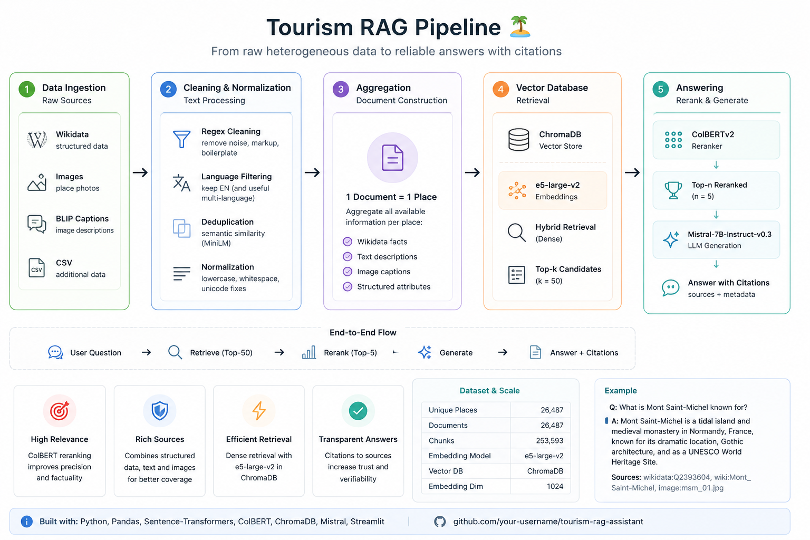
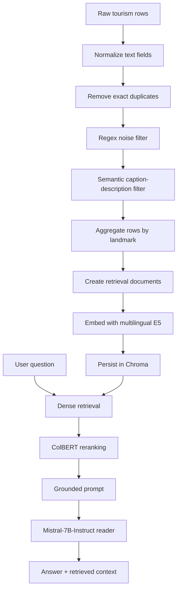
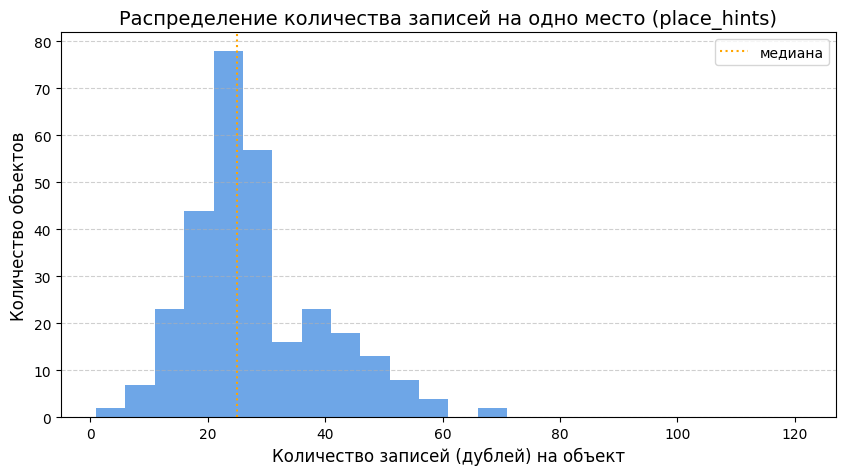
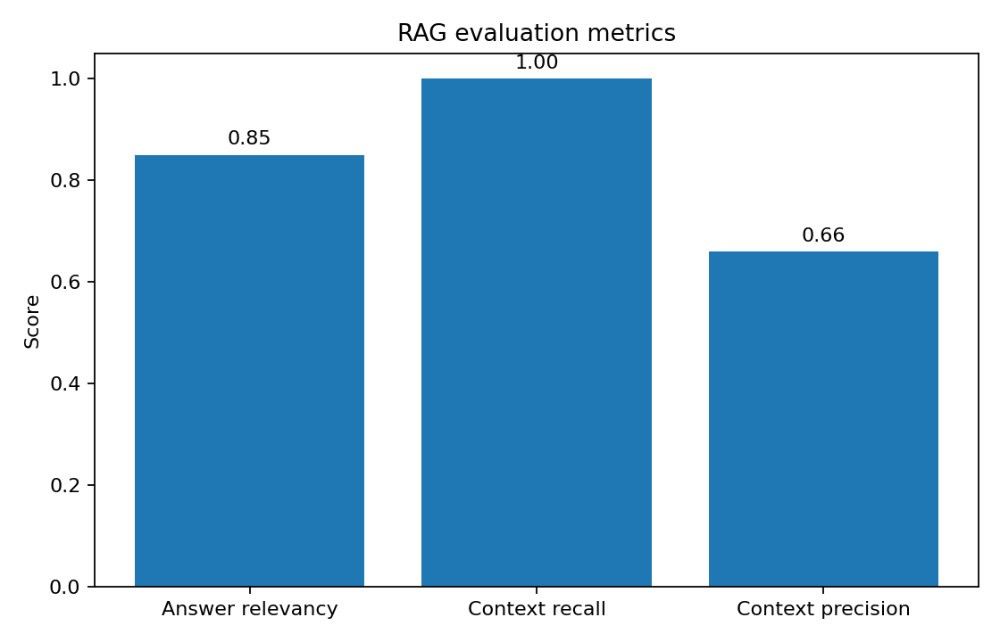
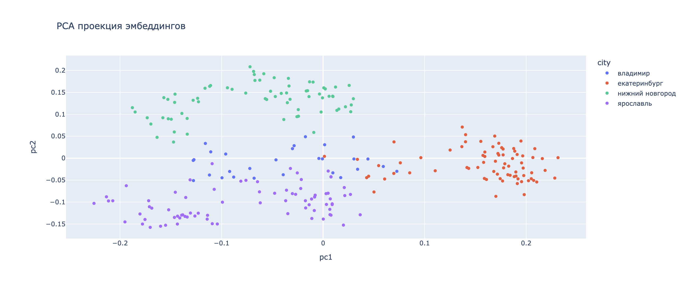
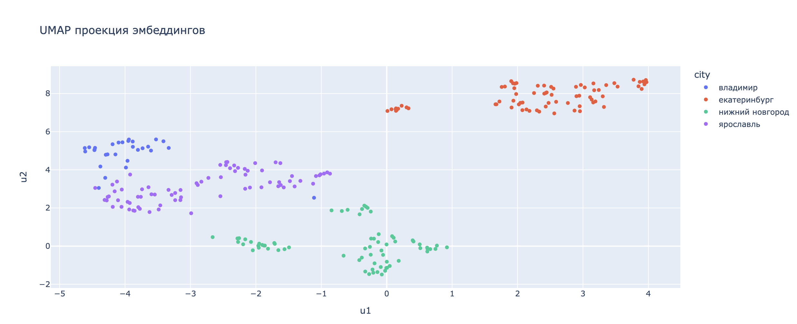

# Tourism RAG Assistant

Tourism RAG Assistant is an end-to-end Retrieval-Augmented Generation (RAG) system that helps users discover Russian landmarks and tourist attractions using grounded responses generated from curated knowledge rather than model memory.

The goal is not to build a generic chatbot. The system is designed to answer from a curated retrieval corpus and make recommendations grounded in the retrieved landmark descriptions.



## Problem

The source dataset contains multiple rows per landmark, generated captions for images, WikiData metadata, coordinates, and city labels. It is useful but noisy:

- one landmark may appear dozens of times;
- generated captions may describe unrelated visual content;
- captions can be duplicated or too generic;
- place names and descriptions need normalization before retrieval;
- direct LLM prompting would not provide reliable grounding or source control.

RAG is a good fit because the system needs to retrieve relevant landmark evidence first, then generate a concise answer from that evidence.

## Architecture



### Components

| Component | Implementation | Purpose |
|---|---|---|
| Data ingestion | `tourism_rag_assistant.ingestion.preprocessing` | Downloads, cleans, filters, and aggregates the raw dataset. |
| Embeddings | `intfloat/multilingual-e5-base` | Encodes aggregated landmark documents for semantic search. |
| Vector store | Chroma | Persists document embeddings and metadata for fast local retrieval. |
| Retrieval | Chroma similarity search | Recalls a broad candidate set for the user query. |
| Reranking | `colbert-ir/colbertv2.0` via RAGatouille | Reorders retrieved passages using late-interaction token matching. |
| Prompting | `tourism_rag_assistant.llm.generator` | Formats retrieved passages and applies strict grounding instructions. |
| Reader LLM | `mistralai/Mistral-7B-Instruct-v0.3` | Generates the final Russian-language answer from retrieved context. |
| Evaluation | `tourism_rag_assistant.evaluation.metrics` | Computes lightweight answer relevancy, context recall, and context precision. |

For a deeper explanation, see [docs/ARCHITECTURE.md](docs/ARCHITECTURE.md).

## Repository Structure

```text
Tourism_RAG_assistant/
|
|-- README.md
|-- LICENSE
|-- Makefile
|-- pyproject.toml
|-- requirements.txt
|-- config/
|   `-- default.yaml
|-- data/
|   `-- README.md
|-- docs/
|   |-- ARCHITECTURE.md
|   `-- PROJECT_STRUCTURE.md
|-- examples/
|   `-- sample_query.md
|-- images/
|-- notebooks/
|-- src/
|   `-- tourism_rag_assistant/
|       |-- ingestion/
|       |-- retrieval/
|       |-- reranking/
|       |-- llm/
|       |-- evaluation/
|       |-- visualization/
|       |-- utils/
|       |-- app/
|       |-- config.py
|       `-- pipeline.py
`-- tests/
```

See [docs/PROJECT_STRUCTURE.md](docs/PROJECT_STRUCTURE.md) for a directory-by-directory description.

## Installation

```bash
cd /Users/Di/Documents/GitHub/Tourism_RAG_assistant
python -m venv .venv
source .venv/bin/activate
make install
```

The default configuration expects a CUDA-capable environment for embedding and LLM inference. To run embeddings on CPU, set:

```bash
export TOURISM_RAG_DEVICE=cpu
```

LLM inference with Mistral-7B still requires suitable local hardware or an adapted serving setup.

## Usage

### 1. Prepare the retrieval corpus

```bash
make prepare
```

This downloads the raw CSV if needed, cleans the data, aggregates rows by landmark, and writes:

```text
data/processed/tourism_rag.csv
```

### 2. Build the vector store

```bash
make index
```

This creates a persisted Chroma collection under:

```text
chroma_db/tourism
```

### 3. Run the Streamlit demo

```bash
make app
```

Example question:

```text
Что посмотреть в Ярославле, если люблю старинные храмы и набережную?
```

The app returns an answer and shows the retrieved documents used as context.

## Python Example

```python
from tourism_rag_assistant.llm.generator import build_reader_llm
from tourism_rag_assistant.pipeline import answer_with_tourism_rag
from tourism_rag_assistant.reranking.colbert import load_reranker
from tourism_rag_assistant.retrieval.vector_store import load_vector_store

knowledge_index = load_vector_store()
reranker = load_reranker()
reader = build_reader_llm()

answer, contexts = answer_with_tourism_rag(
    question="Что посмотреть в Ярославле, если люблю старинные храмы и набережную?",
    reader=reader,
    knowledge_index=knowledge_index,
    reranker=reranker,
    num_retrieved_docs=20,
    num_docs_final=5,
)

print(answer)
```

## Dataset

The project uses a tourism landmark dataset assembled from WikiData-style metadata and generated BLIP image captions. The original data includes:

- landmark names;
- city names;
- WikiData identifiers;
- coordinates;
- text descriptions;
- generated English image captions;
- base64-encoded images.

Observed preprocessing summary from the original project:

| Stage | Count |
|---|---:|
| Raw rows | 12,078 |
| Rows after cleaning | 8,137 |
| Unique objects | 295 |
| Final retrieval documents | 250 |
| Average duplicate rows per object | 27.58 |
| Maximum duplicate rows for one object | 70 |



## Models

| Role | Model |
|---|---|
| Caption-description filtering | `sentence-transformers/paraphrase-multilingual-MiniLM-L12-v2` |
| Retrieval embeddings | `intfloat/multilingual-e5-base` |
| Reranking | `colbert-ir/colbertv2.0` |
| Reader LLM | `mistralai/Mistral-7B-Instruct-v0.3` |

## Evaluation

The project includes lightweight RAG evaluation utilities:

- answer relevancy: embedding similarity between the generated answer and generated follow-up questions;
- context recall: whether at least one retrieved context matches the expected place and city;
- context precision: the fraction of retrieved contexts matching the expected place and city.

Reported values from the original project artifacts:

| Metric | Value |
|---|---:|
| Answer relevancy | 0.85 |
| Context recall | 1.00 |
| Context precision | 0.66 |



These metrics are useful as an initial sanity check, but a production evaluation should add human-labeled query-answer-context examples and citation-level grounding checks.

## Embedding Space Analysis

The original analysis includes PCA and UMAP projections of document embeddings. The observed structure suggests that the embedding space captures location and landmark-type signals well enough for first-stage retrieval.





## Limitations

- The evaluation set is not a fully human-labeled benchmark.
- The current retrieval strategy is dense-only before reranking; there is no BM25 or hybrid search stage.
- The dataset is focused on available landmark rows and may not cover every city or attraction a user asks about.
- The Streamlit app assumes local access to embedding, reranking, and LLM models.
- The system does not yet provide explicit citations in the final answer.
- Image information is used through generated captions, not through a joint image-text retrieval model.

## Roadmap

- Add hybrid retrieval with BM25 plus dense embeddings.
- Add citation spans in generated answers.
- Build a manually labeled evaluation set for retrieval and answer grounding.
- Add multilingual query normalization and query expansion.
- Serve the LLM through a configurable inference backend.
- Add Docker and CI once dependency size and GPU expectations are finalized.

## License

This project is released under the MIT License.
