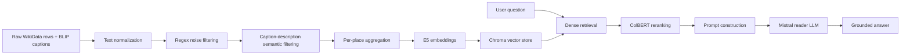

# Architecture

Tourism RAG Assistant is a retrieval-augmented generation system for answering questions about Russian tourism and historical landmarks. The design separates data cleaning, indexing, retrieval, reranking, and answer generation so each part can be evaluated independently.

## High-Level Pipeline

## Document Loading

The ingestion module downloads the source CSV when `data/raw/file.csv` is missing. The raw rows contain landmark metadata, WikiData descriptions, generated English image captions, coordinates, city names, and base64-encoded images.

The loader deliberately keeps raw data outside Git. The dataset is treated as a build artifact because it is large, externally hosted, and may need to be regenerated when preprocessing rules change.

## Data Cleaning and Aggregation

The source data is noisy: the same landmark may appear many times with different captions and images, while some captions describe unrelated visual content. The preprocessing pipeline handles this in layers:

1. Normalize text fields so duplicate detection and grouping are less sensitive to casing and whitespace.
2. Drop rows without the minimum landmark metadata needed for retrieval.
3. Remove exact duplicate captions.
4. Canonicalize names by grouping rows that share the same WikiData ID.
5. Apply regex filters for obvious non-landmark artifacts such as posters, advertising, maps, cars, portraits, and social media noise.
6. Encode WikiData descriptions and generated captions with a multilingual sentence-transformer model.
7. Keep captions whose semantic similarity to the structured description passes the configured threshold.
8. Aggregate each place into a single retrieval document by selecting captions nearest to the TF-IDF centroid of that place group.
9. Sample a city-balanced final corpus of 250 documents.

This layered approach is intentionally conservative. Regex removes high-confidence noise cheaply; semantic filtering catches captions that are grammatical but unrelated to the landmark; aggregation reduces duplicate pressure on retrieval.

## Embeddings

The retrieval index uses `intfloat/multilingual-e5-base` with normalized embeddings. E5-style embeddings are a practical fit here because user questions and documents can contain Russian and English text, and cosine similarity over normalized vectors is well supported by Chroma.

The cleaning stage uses `sentence-transformers/paraphrase-multilingual-MiniLM-L12-v2`. It is lighter than the retrieval embedding model and is used only to estimate whether a generated caption is semantically compatible with the WikiData description.

## Vector Store

The vector store is Chroma. Each aggregated landmark row becomes one LangChain `Document` with:

- `page_content`: Russian field labels, city, WikiData description, and aggregated image-caption text.
- `metadata`: place hints, WikiData ID, city, and optional base64 image.

Chroma is persisted under `chroma_db/tourism`, which is ignored by Git. Persisting the index avoids recomputing embeddings every time the Streamlit demo starts.

## Retrieval

At query time, the system performs dense retrieval against Chroma. The first-stage retriever uses a relatively broad `top_k` because dense retrieval is optimized for recall: it should gather plausible candidates, even if some are only loosely related.

The pipeline deduplicates retrieved page contents before reranking. This matters because source data was duplicate-heavy and the same or nearly identical landmark content can otherwise dominate the prompt.

## ColBERT Reranking

ColBERT is used as a second-stage reranker over retrieved passages. Dense retrieval compresses a document into a single vector, which is efficient but can miss fine-grained token-level matches such as a specific city, landmark type, or user preference. ColBERT keeps late-interaction token representations, making it better suited for selecting the most relevant passages from a small candidate set.

In this project, ColBERT is not responsible for searching the whole corpus. It reranks the top candidates returned by Chroma and passes only the best passages to the reader LLM.

## Prompt Construction

The prompt has a strict system instruction:

- answer only from the supplied context;
- do not invent facts;
- admit when context is insufficient;
- answer clearly in Russian;
- mention the landmark and city when appropriate.

The retrieved passages are formatted as numbered extracted documents. The prompt is intentionally simple because the main grounding mechanism is retrieval quality, not prompt complexity.

## LLM Generation

The reader model is `mistralai/Mistral-7B-Instruct-v0.3`. The generator receives the user question and reranked context, then produces a short grounded answer. The generation call in the pipeline uses deterministic decoding for the final answer (`do_sample=False`, `temperature=0.0`) to reduce run-to-run variation during evaluation and demo use.

## Evaluation

The project includes lightweight evaluation utilities:

- answer relevancy via embedding similarity between the generated answer and LLM-generated follow-up questions;
- context recall based on whether at least one retrieved context overlaps with the expected place and city;
- context precision based on the fraction of retrieved contexts matching the expected place and city.

The reported values in the README come from the original project artifacts:

| Metric | Value |
|---|---:|
| Answer relevancy | 0.85 |
| Context recall | 1.00 |
| Context precision | 0.66 |

These metrics are useful for portfolio-level inspection, but they are not a substitute for a fully curated human-labeled benchmark. A production version should add manually labeled query-context-answer triples.

## Why This Architecture

The architecture reflects the data problem. The raw dataset is multimodal and duplicate-heavy, so improving the corpus is as important as selecting an LLM. A single-vector dense retriever provides a simple, fast first stage; ColBERT improves precision before context is passed to the generator; the LLM is constrained to synthesize from retrieved evidence rather than act as an open-ended tourism chatbot.

This keeps the system modular: data quality, retrieval quality, reranking behavior, and answer generation can be debugged separately.

